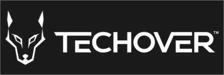

# Kanban

## Vad görs denna branch

-   Skapar **board** komponenten
-   Skapar **ticket** komponenten

## Övergripande

En responsive Kanban board skapad med relevanta verktyg (se nedan). Applikationen består av ca 8 komponenter. I applikationen finns möjlighet att exempelvis se alla sina projekt, skapa nya tickets och projekt, se alla tickets för det olika projekten, förflytta olika tickets mellan olika kolumner.

### Upplägg

Kanban projektet kommer byggas under 5 dagar med 2 föreläsningar per dag. Varje föreläsning kommer fokusera på att bygga ut vissa delar i taget. För varje föreläsning finns en motsvarande **Branch** och **Pull request** som har namn som exempelvis **F1** för **föreläsning 1**, du hittar alla **Pull requests** [här](https://github.com/MMR-Solutions-AB/Kanban-V15/pulls). Vill du se vad som gjordes en specifik föreläsning är det bara att tryck på respektive **Pull request** för den föreläsningen. Det finns även ett par **Pull requests** och **Branches** som inte har namn som exempelvis **F1**, dessa är extra uppgifter som du ska göra utöver föreläsningar. Du hittar all info om vad som ska göras i **README.md** filen i den branchen.

### Starta Applikationen

För att starta projektet, är det t å saker du behöver göra.

1. Se till att du har laddat ner **node_modules**
2. När du har laddat ner **node_modules** är det bara att köra **npm run dev** i terminalen och sen öppna [http://127.0.0.1:5173/](http://127.0.0.1:5173/)

### Verktyg

Applikationen använder följande Node module paket

-   React
-   React context
-   SCSS
-   Drag and drop

### Dokumentation:

-   [React](https://beta.reactjs.org/)
-   [React context](https://redux-toolkit.js.org/introduction/getting-started)
-   [SCSS](https://sass-lang.com/documentation/)

## Live demo

Om du vill se hur den färdiga sidan ska se hut kan du göra det [här](https://voluble-figolla-55bb8e.netlify.app/)
